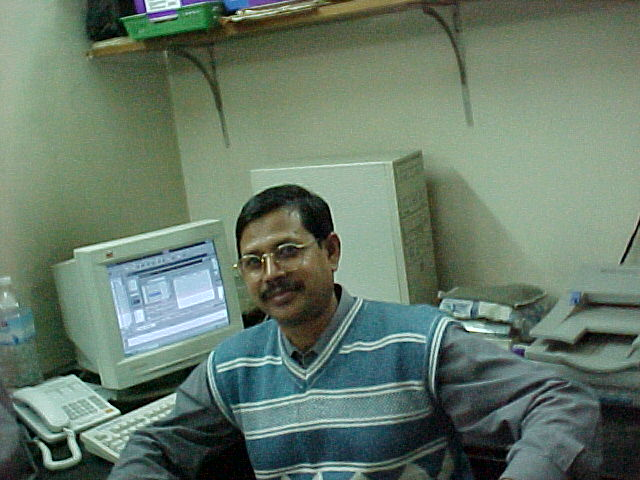

<!--markdown tutorial-->

Kazi Salam <br/> This is second line

---

# Kazi Salam

## Kazi Salam

### Kazi Salam

#### Kazi Salam

##### Kazi Salam

###### Kazi Salam

<p>This is Kazi Salam.
I am 68 years old.
Since 1997 using Internet.</p>

<br/>

### italic text

_This is an italic_

### bold text

**This is an italic**

### Strikethrough

~~This is an italic~~

<br/>

<u>This is an italic</u>

**This is an italic**

### Single Line code

`This is inline text`  
`<h1>Bangladesh</h1>`

<br/>

### Multiple Line Code

```
<html>
<head></head>
<body></body>
</html>
```

```
CSS
head{
  background-color: green;
}
```

```javascript
console.log('hello');
```

<br/>

### Ordered List

1. item1
2. item2
   1. item1.1
   2. item1.2
3. item3

<br/>

### Unordered List

- item1
  - item1.1
  - item1.2
  - item1.3
- item2
- item3

<br/>

### Task List

- [x] Task1
- [x] Task1
- [] Task1

<br/>

### automatic link

https://webtechdbd.com

### Disable link

`https://webtechdbd.com`

### markdown link syntax

[Mywebsite](https://webtechdbd.com)

### markdown link syntax

[Mywebsite][websitelink]

<br/>

### image syntax

<!--  -->



### emoji syntax

<!-- copy paste -->

😊 🙂 😄 😀 😁

<br/>

### table syntax

| Name       | Email                |
| ---------- | -------------------- |
| Kazi Salam | webtechdbd.com       |
| Kazi Salam | kbhsbd2012@gmail.com |
| Kazi Salam | Dhaka, Bangladesh    |

<!--all link is here-->

[websiteLink]: https://webtechdbd.com
